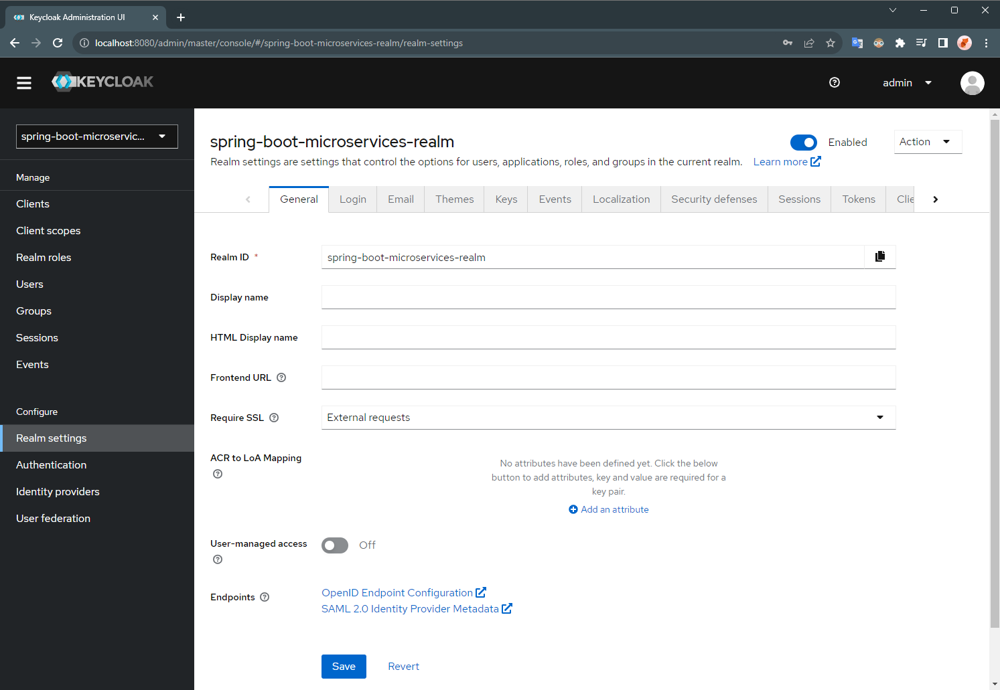
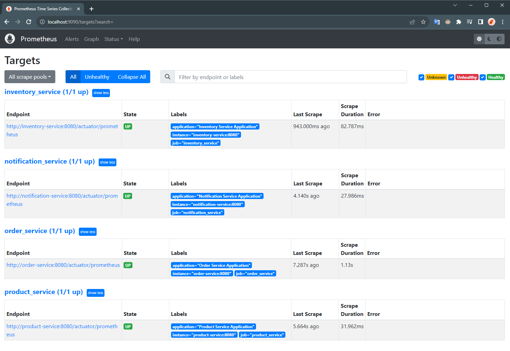
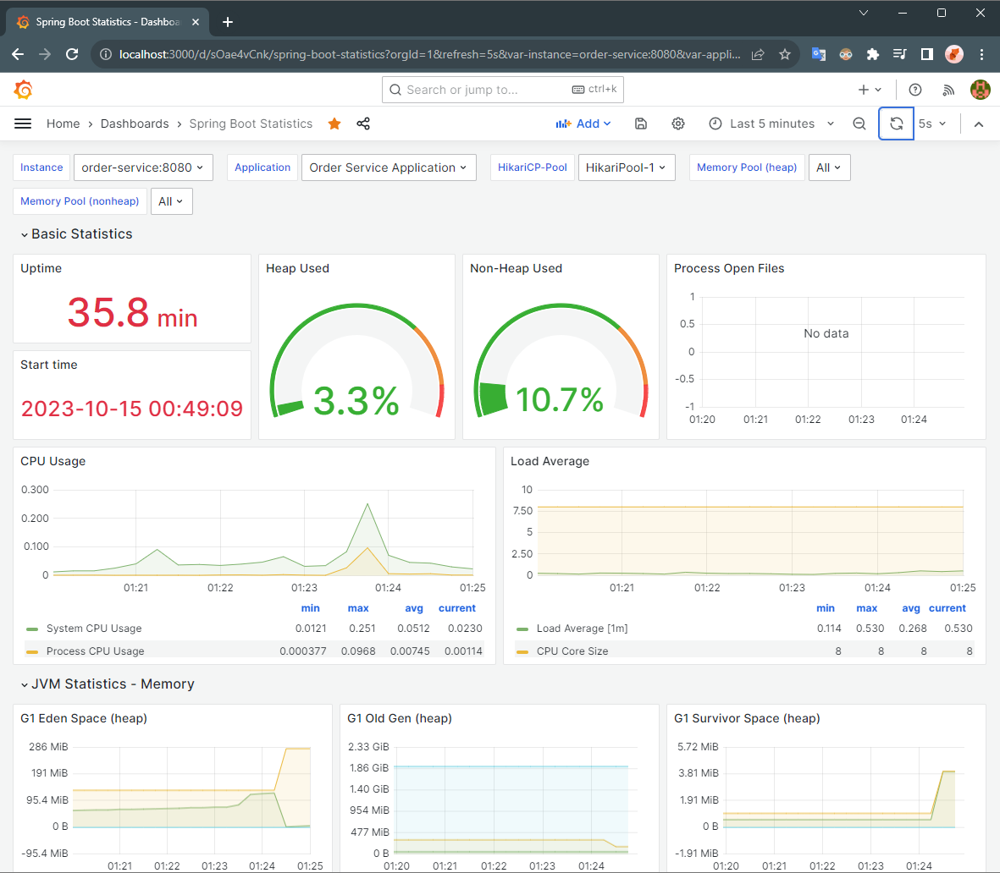
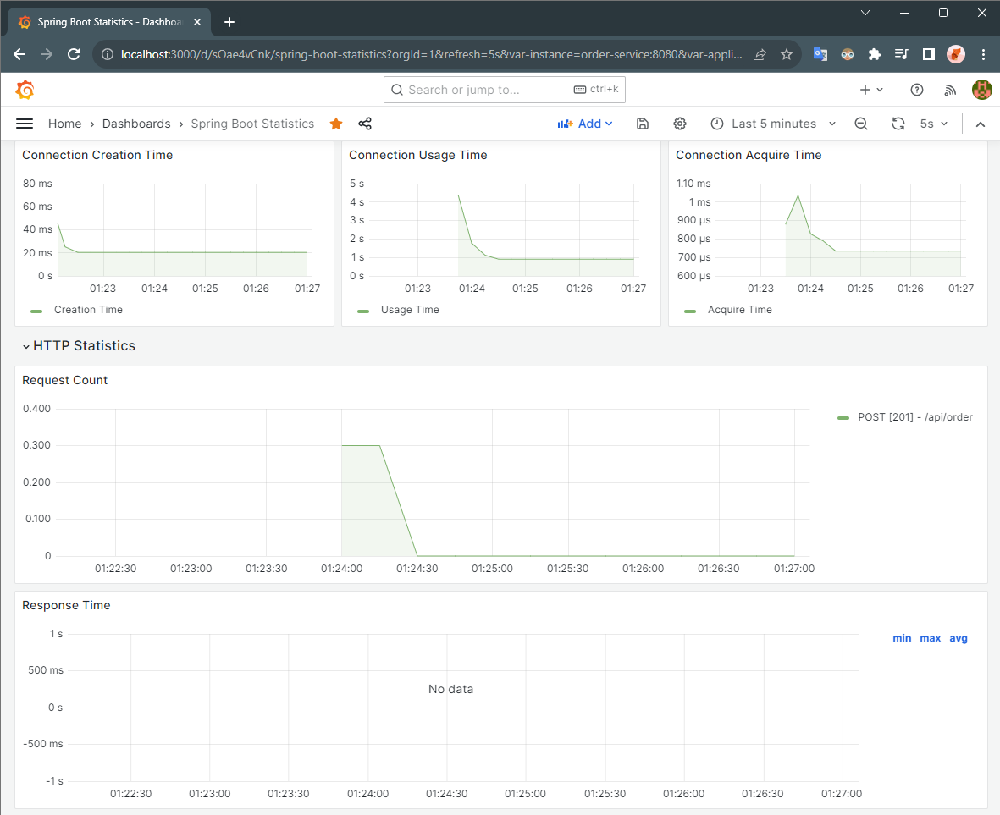

# Micro Marketplace: An E-commerce Microservices Application

## Solution Overview

Micro Marketplace is a robust e-commerce application built on a microservices architecture using Spring technologies and other open-source tools. 
- This platform leverages the power of **Spring Boot**, **Netflix Eureka**, **Spring Cloud Gateway**, and **KeyCloak** for service development, discovery, gateway management, and security, respectively. 

- It offers extensive observability into the application using  **Prometheus** and **Grafana** for monitoring and visualization. 


### Solution Architecture


### Services
- **Product Service:** Responsible for managing product information, including creation, retrieval, and updates. It uses a MongoDB database.
- **Order Service:** Handles order management, including creating and retrieving orders. It uses a MySQL database.
- **Inventory Service:** Manages products inventory. It also uses a MySQL database.
- **Notification Service:** A stateless service responsible for sending notifications to users regarding their orders or other relevant updates.

### Major Components
- **Discovery Server:** Netflix Eureka is employed for service registration and discovery, allowing microservices to locate and interact with each other dynamically.
- **API Gateway:** Spring Cloud Gateway is deployed to serve as the entry point for all external requests, effectively routing traffic to the appropriate microservices.
- **Auth Server:** For robust authentication and authorization mechanisms, KeyCloak is used to secure the microservices and protect sensitive data.


## Getting Started

### Prerequisites
1. Docker and Docker Compose should be installed.
2. Docker should be running.

### Deployment

1. Navigate to the project directory:
   ```shell
   cd ecommerce-microservices
   ```

2. Start the containers:
   ```shell
   docker compose up -d
   ```


3. Confirm that the containers are up and running:
   ```shell
   docker ps
   ```


## Usage


### Interacting with Application

- **Getting Credentials from KeyCloak**
  - Access the KeyCloak Admin UI at http://localhost:8080/
  - Go to the Realm `spring-boot-microservices-realm`
  - Go to the Client `spring-cloud-client`
  - Go the the 'Credentials' section, and get the 'Client Secret'


- **Setup Postman Authentication** [Required in the next steps]
  - On the Request page, set Authorization:
    - Type: `OAuth 2.0`
    - Configure New Token with:
      - Token Name: `token`
      - Grant Type: `Client Credentials`
      - Access Token URL: `http://keycloak:8080/realms/spring-boot-microservices-realm/protocol/openid-connect/token`
      - Client ID: `spring-cloud-client`
      - Client Secret: `<client-secret>` (which you copied in the last step from KeyCloak)
    - Click on "Get New Access Token" and then click "Use Token"

    > NOTE: For getting the access token from the keycloak container with the local machine, it is required to add a row with `127.0.0.1 keycloak` in the file: `C:\Windows\System32\drivers\etc\hosts` or `/etc/hosts`  

- **Accessing API Endpoints**
  - **POST /api/product**
    - Method: POST
    - Endpoint: http://localhost:8181/api/product
    - Authorization: Use the OAuth 2.0 token fetched, following the previous step.
    - Body: 
      ```json
      {
         "name": "Iphone 15",
         "description": "Apple Iphone 15",
         "price": 1500
      } 
      ```
    - Output:
        
  
  - GET /api/product
    - Method: GET
    - Endpoint: http://localhost:8181/api/product
    - Authorization: Use the OAuth 2.0 token fetched, following the previous step.
    - Output:
        
 
  - POST /api/order
    - Method: POST
    - Endpoint: http://localhost:8181/api/order
    - Authorization: Use the OAuth 2.0 token fetched, following the previous step.
    - Body:
      ```json
      {
         "orderLineItemsDtoList": [
           {
              "skuCode": "iphone_15_pro",
              "price": 2000,
              "quantity": 1
            }
         ]
      }  
      ```
    - Output:
      
      

### Components UI

- KeyCloak Admin UI
   - Keycloak UI can be accessed on http://localhost:8080/
   - Realm: `spring-boot-microservices-realm`
     
   - Client: `spring-cloud-client`
    


- Eureka Dashboard
   - Services (Clients) discovered can be viewed on http://localhost:8761/
    


- Prometheus UI
    - Prometheus UI can be accessed on http://localhost:9090/
    - Prometheus Graph Query
      
    - Prometheus Targets Health
      
    - Prometheus Service Discovery Status
      

- Grafana Dashboard
  - Grafana Dashboard can be accessed on http://localhost:3000/
  - To visualize the application, create a 'Data Source' and import the dashboard using `grafana-dashboard.json` file.
  - Data Source
    
  
  - Dashboard
    
    


## Environment Cleanup

- To completely stop and remove the containers and other resources (network, volume, etc.), run the following command:
   ```shell
   docker compose down -v
   ```
